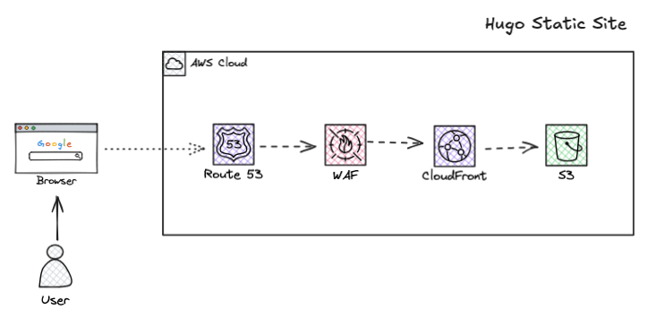

# BuildWithEM Site 🚀

A modern DevOps blog and portfolio site built with Hugo, the Blowfish theme, and deployed to AWS infrastructure. This repository contains the complete site source code and deployment configuration.

## 🌐 Live Site
Visit the live site at: [buildwithem.com](https://buildwithem.com)

## 🛠️ Tech Stack



- **[Hugo](https://gohugo.io/)** - Fast static site generator
- **[Blowfish Theme](https://blowfish.page/)** - Modern, responsive Hugo theme
- **[AWS S3 + WAF + CloudFront](https://aws.amazon.com/)** - Global content delivery and hosting
- **[GitHub Actions](https://github.com/features/actions)** - Automated CI/CD pipeline
- **[Terraform](https://www.terraform.io/)** - Infrastructure as Code (see [buildwithem-infra](https://github.com/em-scrn/buildwithem-infra))

## 📁 Project Structure

```
buildwithem-site/
├── config/
│   └── _default/
│       ├── config.yaml      # Hugo site configuration
│       ├── params.yaml      # Theme parameters and customization
│       └── menus.yaml       # Site navigation structure
├── content/
│   ├── blog/               # Blog posts and articles
│   │   └── _index.md      # Blog section homepage
│   ├── about.md           # About page
│   └── resume.md          # Professional resume
├── layouts/
│   └── 404.html           # Custom 404 error page
├── themes/
│   └── blowfish/          # Blowfish theme (git submodule)
├── assets/
│   └── css/
│       └── custom.css     # Custom styling and overrides
├── static/
│   └── img/              # Images and static assets
├── .github/
│   └── workflows/
│       └── deploy.yml    # GitHub Actions deployment pipeline
└── .gitignore
```

## 🚀 Quick Start

### Prerequisites
- [Hugo](https://gohugo.io/installation/) (extended version)
- [Git](https://git-scm.com/)
- [Node.js](https://nodejs.org/) (optional, for theme development)

### Local Development

1. **Clone the repository:**
   ```bash
   git clone https://github.com/em-scrn/buildwithem-site.git
   cd buildwithem-site
   ```

2. **Initialize the theme submodule:**
   ```bash
   git submodule update --init --recursive
   ```

3. **Start the development server:**
   ```bash
   hugo server --disableFastRender
   ```

4. **Open your browser:**
   Navigate to `http://localhost:1313`

The site will automatically reload when you make changes to the content or configuration files.

## ✍️ Content Management

### Adding a New Blog Post

1. Create a new markdown file in `content/blog/`:
   ```bash
   hugo new blog/my-new-post.md
   ```

2. Edit the frontmatter and content:
   ```yaml
   ---
   title: "My New Post"
   date: 2025-06-12
   description: "Brief description of the post"
   tags: ["devops", "aws", "automation"]
   categories: ["Technical"]
   showHero: false
   ---
   
   Your content here...
   ```

### Updating Pages

- **About Page**: Edit `content/about.md`
- **Resume**: Edit `content/resume.md`
- **Site Configuration**: Modify files in `config/_default/`

## 🎨 Customization

### Theme Configuration
The site uses extensive customization through `config/_default/params.yaml`. Key areas include:

- **Color Schemes**: Currently using "congo" scheme
- **Homepage Layout**: Configured for profile layout
- **Navigation**: Blog-focused navigation structure
- **Features**: Search, code copying, table of contents

### Custom Styling
Additional styling is handled through `assets/css/custom.css`, including:

- Responsive design adjustments
- Custom terminal cursor animation
- Avatar styling for the about page
- Typography and spacing refinements

## 🚀 Deployment

### Automatic Deployment
The site automatically deploys to AWS infrastructure when changes are pushed to the `main` branch via GitHub Actions.

**Required GitHub Secrets:**
- `AWS_ACCESS_KEY_ID`
- `AWS_SECRET_ACCESS_KEY`
- `S3_BUCKET_NAME`
- `CLOUDFRONT_DISTRIBUTION_ID`

### Manual Deployment
To deploy manually:

1. **Build the site:**
   ```bash
   hugo --minify
   ```

2. **Sync to S3:**
   ```bash
   aws s3 sync public/ s3://your-bucket-name --delete
   ```

3. **Invalidate CloudFront:**
   ```bash
   aws cloudfront create-invalidation --distribution-id YOUR_DISTRIBUTION_ID --paths "/*"
   ```

## 🏗️ Infrastructure

The AWS infrastructure for this site is managed separately in the [buildwithem-infra](https://github.com/em-scrn/buildwithem-infra) repository, which includes:

- S3 bucket for static hosting
- CloudFront distribution for global CDN
- WAF for security protection
- Route53 for DNS management
- ACM for SSL certificates

## 📄 License

This project is open source and available under the [MIT License](LICENSE).

## 🔗 Related Repositories

- **[buildwithem-infra](https://github.com/em-scrn/buildwithem-infra)** - Terraform infrastructure code
- **[Blowfish Theme](https://github.com/nunocoracao/blowfish)** - Hugo theme used for this site